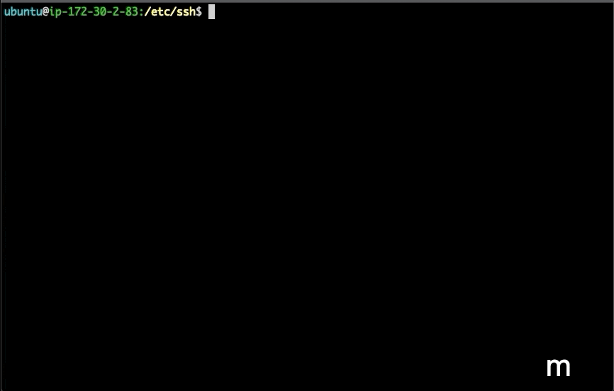

# CmdGuru

CmdGuru provides several handy bash functions and hundreds of frequently used Linux commands. With it, you can search for any commands or jump to predefined directories instantly. It can help you become a command line **Guru** in no time.

## Demo

#### Search for Commands

#### Directory browsing

## Installation

* Clone or fork this repository.
* Run `cp .cmd .cd_bmarks ~/`
* Run `source bashrc` for trial or `cat bashrc >> ~/.bashrc && source ~/.bashrc` for daily use

## Usage

* `s [keyword1] .. [keyword_n]` (short for **search**): search for commands which match all the keywords. If there's only one match, it'll be chosen directly. On MacOS or Linux Desktop with **xclip** installed, the command will be sent to clipboard, otherwise it'll be appended to the bash history, and could be recalled via **`!!`** later.
* `d` (short for **dump**): dump the previous command to the command list, then you can reuse it later.
* `cmd`: open the command list file with $EDITOR, then you can modify commands or add comments.
* `m [mark]` (short for **mark**): search for the given bookmark (i.e., [mark], which could be any string without tab), if there's a match, jump to that directory directly. Otherwise, add this bookmark and current working directory to the directory list, then you can use this bookmark to go to this directory later.
* `m`: show the directory list, each line starts with a bookmark, followed by a directory path. Then you can input a bookmark to go to the corresponding folder, or input 'E' to open the bookmark file.
* `beep`: get a notification when a command is done. e.g., `make -j16; beep`
* `ex`: call corresponding command to uncompress or extract a tarball. e.g., `ex file.tar.gz`. Supported file extensions are: `.tar.bz2`, `.tar.gz`, `.tar.xz`, `.bz2`, `.rar`, `.gz`, `.tar`, `.tbz2`, `.tgz`, `.zip`, `.Z`, `.7z`.
* `ss`: a wrapper for `screen`. `ss sessionname` will attach to a session with the given name if it's already existed, otherwise it will create it.
* `tt`: a wrapper for `tmux`. `tt sessionname` will attach to a session with the given name if it's already existed, otherwise it will create it.

## Tips
* A comment is at the end of a line and starts with " // ", which is used for **matching only**.
* A comment with detailed description can help you recall the command easily.
* For Linux users, please have **xclip** installed, so that the command/info could be sent to system clipboard and pasted anywhere.
* All kinds of information (email addresses, website URLs, etc) could be saved to command list for quick access.
* It's OK to have spaces in directory paths, but no tab allowed.

## License

The code in this project is licensed under the MIT License. See [LICENSE](LICENSE) for details.
